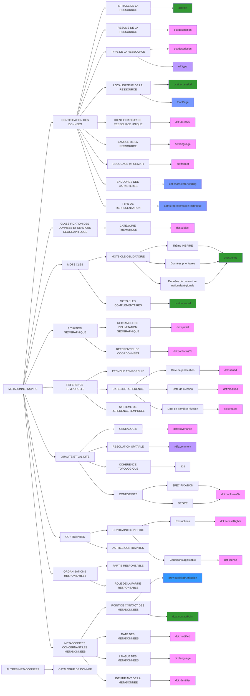

# Mapping INSPIRE DCAT
Ce dossier a pour vocation de rassembler des ressources utiles aux travaux de mise en correspondace entre les métadonnées INSPIRE ISO 19115 et GeoDCAT-AP. 

```mermaid
flowchart LR;
 classDef dct fill:#f9f;
 classDef prov fill:#39f;
 classDef dcat fill:#393;
 classDef other fill:#79f;
 classDef rdf fill:#b9f;


    
    ISO[METADONNE INSPIRE]-->A1;
    ISO-->A2;
    ISO-->A3;
    ISO-->A4;
    ISO-->A5;
    ISO-->A6;
    ISO-->A7;
    ISO-->A8;
    ISO-->A9;
    X1[AUTRES METADONNEES]-->Y1[CATALOGUE DE DONNEE];
    
    	A1[IDENTIFICATION DES DONNEES]-->B[INTITULE DE LA RESSOURCE];
		click A1 "https://github.com/cnigfr/metadonnee/blob/main/MappingINSPIRE-DCAT/Identification.md"
    		B-->TITLE["dct:title"]:::dcat;
    		A1-->C[RESUME DE LA RESSOURCE];
		C-->DESC["dct:description"]:::dct;
    		A1-->D[TYPE DE LA RESSOURCE];
		D-->DTYP["dct:description"]:::dct;
		D-->RTYP["rdf:type"]:::rdf;
	    	A1-->E[LOCALISATEUR DE LA RESSOURCE];
		E-->AURL["dcat:accessUrl"]:::dcat;
		E-->FPAG["foaf:Page"]:::other;
    		A1-->F[IDENTIFICATEUR DE RESSOURCE UNIQUE];
		F-->DID["dct:identifier"]:::dct;
    		A1-->G[LANGUE DE LA RESSOURCE];
		G-->DLANG["dct:language"]:::dct;
    		A1-->H["ENCODAGE (=FORMAT)"];
		H-->DFMT["dct:format"]:::dct;
    		A1-->I[ENCODAGE DES CARACTERES];
		I-->ENCOD["cnt:characterEncoding"]:::other;
		A1-->J[TYPE DE REPRESENTATION];
		J-->REPT["adms:representationTechnique"]:::other;
    	A2[CLASSIFICATION DES DONNEES ET SERVICES GEOGRAPHIQUES]-->B2[CATEGORIE THEMATIQUE];
		B2-->SUBJ["dct:subject"]:::dct;
		click A2 "https://github.com/cnigfr/metadonnee/blob/main/MappingINSPIRE-DCAT/Classification.md"
    	A3[MOTS CLES]-->B3[MOTS CLE OBLIGATOIRE];
		click A3 "https://github.com/cnigfr/metadonnee/blob/main/MappingINSPIRE-DCAT/MotCle.md"
		B3-->B33[Thème INSPIRE];
		B3-->B34[Données prioritaires];
		B3-->B35[Données de couverture nationale/régionale];
		B33-->THEM["dcat:theme"]:::dcat
		B34-->THEM;
		B35-->THEM;
		A3-->C3[MOTS CLES COMPLEMENTAIRES];
		C3-->KWD["dcat:keyword"]:::dcat;	
	A4[SITUATION GEOGRAPHIQUE]-->B4[RECTANGLE DE DELIMITATION GEOGRAPHIQUE];
		click A4 "https://github.com/cnigfr/metadonnee/blob/main/MappingINSPIRE-DCAT/SituationGeo.md"
		B4-->Z4["dct:spatial"]:::dct;
		A4-->C4[REFERENTIEL DE COORDONNEES];
		C4-->DCONF["dct:conformsTo"]:::dct;
	A5[REFERENCE TEMPORELLE]-->B5[ETENDUE TEMPORELLE];
		click A5 "https://github.com/cnigfr/metadonnee/blob/main/MappingINSPIRE-DCAT/RefTemporelle.md"
		A5-->C5[DATES DE REFERENCE];
		C5-->C51[Date de publication];
		C51-->ISS["dct:issued"]:::dct;
		C5-->C52[Date de création];
		C52-->DMOD["dct:modified"]:::dct;
		C5-->C53[Date de dernière révision];
		C53-->DCRE["dct:created"]:::dct;
		A5-->D5[SYSTEME DE REFERENCE TEMPOREL];
	A6[QUALITE ET VALIDITE]-->B6[GENEALOGIE];
		click A6 "https://github.com/cnigfr/metadonnee/blob/main/MappingINSPIRE-DCAT/Qualite.md"
		B6-->B61["dct:provenance"]:::dct;
		A6-->C6[RESOLUTION SPATIALE];
		C6-->C61["rdfs:comment"]:::rdf;
		A6-->D6[COHERENCE TOPOLOGIQUE];
		D6-->D61[???];
		A6-->E6[CONFORMITE];
		E6-->E61[SPECIFICATION];
		E6-->E62[DEGRE];
		E61-->E611["dct:conformsTo"]:::dct;
		E62-->E611;
	A7[CONTRAINTES]-->B7[CONTRAINTES INSPIRE];
		click A7 "https://github.com/cnigfr/metadonnee/blob/main/MappingINSPIRE-DCAT/Contraintes.md"
		B7-->B71[Restrictions];
		B71-->B711["dct:accessRights"]:::dct;
		B7-->B72[Conditions applicable];
		B72-->B721["dct:license"]:::dct;
		A7-->C7[AUTRES CONTRAINTES];
	A8[ORGANISATIONS RESPONSABLES]-->B8[PARTIE RESPONSABLE];
		click A8 "https://github.com/cnigfr/metadonnee/blob/main/MappingINSPIRE-DCAT/OrganisationResp"
		A8-->C8[ROLE DE LA PARTIE RESPONSABLE];
	A9[METADONNEES CONCERNANT LES METADONNEES]-->B9[POINT DE CONTACT DES METADONNEES];
		click A9 "https://github.com/cnigfr/metadonnee/blob/main/MappingINSPIRE-DCAT/Metadonnees.md"
		B9-->QUALATT["prov:qualifiedAttribution"]:::prov;
		B9-->CONTA["dcat:contactPoint"]:::dcat;
		A9-->C9[DATE DES METADONNEES];
		C9-->MODIF["dct:modified"]:::dct;
		A9-->D9[LANGUE DES METADONNEES];
		D9-->LANG["dct:language"]:::dct;
		A9-->E9[IDENTIFIANT DE LA METADONNEE];
		E9-->IDENT["dct:Identifier"]:::dct;
		
    ""
```
