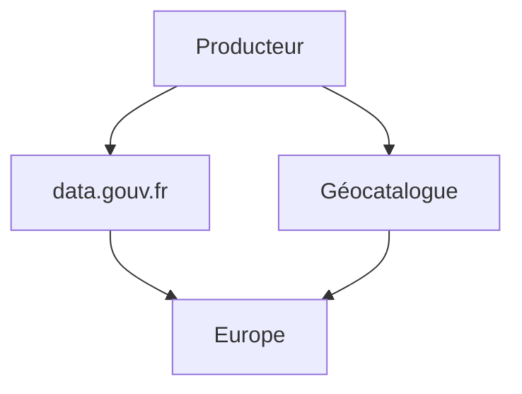

Petite introduction sur les éléments glanés à la conférence INSPIRE. Le replay est disponible ici : https://webcast.ec.europa.eu/inspire-conference-2023-0a-23-11-28 (session 3, la dernière).

Le modèle de métadonnées pour le rapportage HVD a été publié le 14 décembre 2023 : https://semiceu.github.io/DCAT-AP/releases/2.2.0-hvd/

Les travaux de coordination entre la communauté INSPIRE et HVD se poursuivent. Les rapportages de l'un et de l'autre vont d'ailleurs être alignés. 

Dans ce contexte il est important au niveau national d'assurer une cohérence entre l'un et l'autre. Pour l'instant les listes de l'un et de l'autre ne sont pas alignées. Un rapportage basé sur les métadonnées devrait permettre cette cohérence d'information entre les 2. 
 
La réunion a permis de passer en revue les besoins de coordination pour assurer le rapportage des métadonnées HVD. Il apparaît qu'un producteur de données devra transmettre/faire moissonner sa métadonnée à la fois par la "branche INSPIRE" (métadonnées ISO 19139 et CSW pour le Géocatalogue) et par la "branche HVD" (métadonnées DCAT pour gata.gouv.fr).

(Note : geodata.gouv ets à cloturer définitivement pour ne pas compliquer ce paysage). 

L'usage de Geonetwork 4.0 devrait permettre ce double moissonnage sans trop de soucis.

- [ ] Investiguer quel sera le support de GeoDCAT par les futures versions de Geonetwork 4.0. 

Les producteurs qui utilisent d'autres solutions de catalogage pourraient être amenés à devoir faire des développements à façon. Dans ce cas, il est nécessaire de bien documenter les traductions. Des XSLT de transformations des métadonnées INSPIRE vers GeoDCAT-AP existent (https://geodcat-ap.semic.eu/api/).

- [ ] Evaluer le résultat du XSLT et déterminer s'il peut convenir pour la "branche HVD".
      -> Une exemple est disponible ici : https://github.com/cnigfr/metadonnee/blob/main/MappingINSPIRE-DCAT/Exemples/ignf_elf_administrative_unit_1-0-xml.rdf
      

## Passage en revue des éléments de métadonnées

Les éléments de métadonnées à discuter sont passés en revue. Des issues github ont été créé pour chacun.

Identificateurs : 
https://github.com/cnigfr/metadonnee/issues/28
"Tag" des données HVD : 
https://github.com/cnigfr/metadonnee/issues/29
Licences :
https://github.com/cnigfr/metadonnee/issues/21

Métadonnées de service : Les HVD requièrent une description fine du service. Il faudra évaluer le besoin. 

Un appel à candidatures pour des producteurs pilotes du double moissonnage ets lancé. 

Une 2ème réunion métadonnée est programmé le 26 janvier à 10h.
